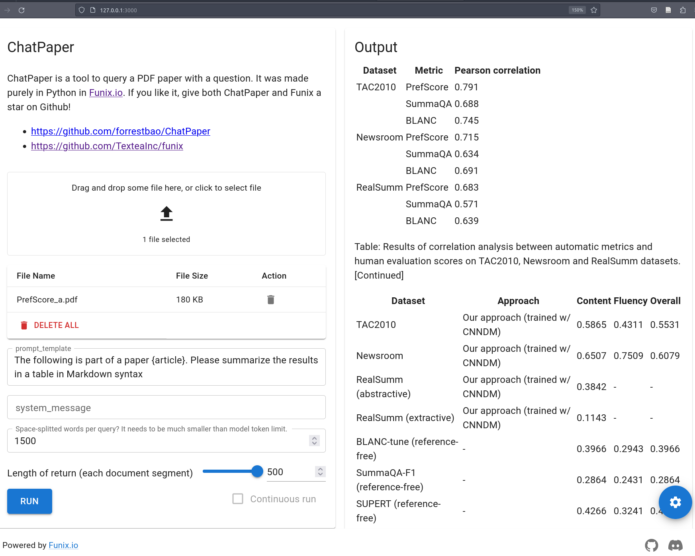

# ChatPaper

Upload a PDF file, and ask it to perform tasks (e.g., information extraction) about this paper. 

Yes, it is like ChatPDF. But since ChatPaper is in Python, you can easily leverage ecosystem and built-in string operations of Python to extend it. ChatPaper is open source under the terms of AGPL. 

And, thanks to [Funix.io](http://funix.io), ChatPaper's code contains only the core logic. Nothing else about the UI. In no other libraries can you build a chatbot in shorter code. 

The screenshot below is the app in action by analysing the syllabus of the Machine Learning class taught by the author. 



**Contact**: forrest dot bao [in] Gmail 

## Setup

Please create a file called `ChatPaper_conf.py` and include your OpenAI API key like this:

```python
openai_api_key = "sk-freedom-france-usa" 
```

Then run the following command to install the dependencies:

```bash
pip install -r requirements.txt
```

Finally, run the following command to start the server:

```bash
funix ChatPaper
```

## Coming next

* Log-in support 
* Saving history


## Disclaimer

This app is officially sponsored nor endorsed by Iowa State University. Views expressed in this app are solely those of the author and GPT3.5/4 models.